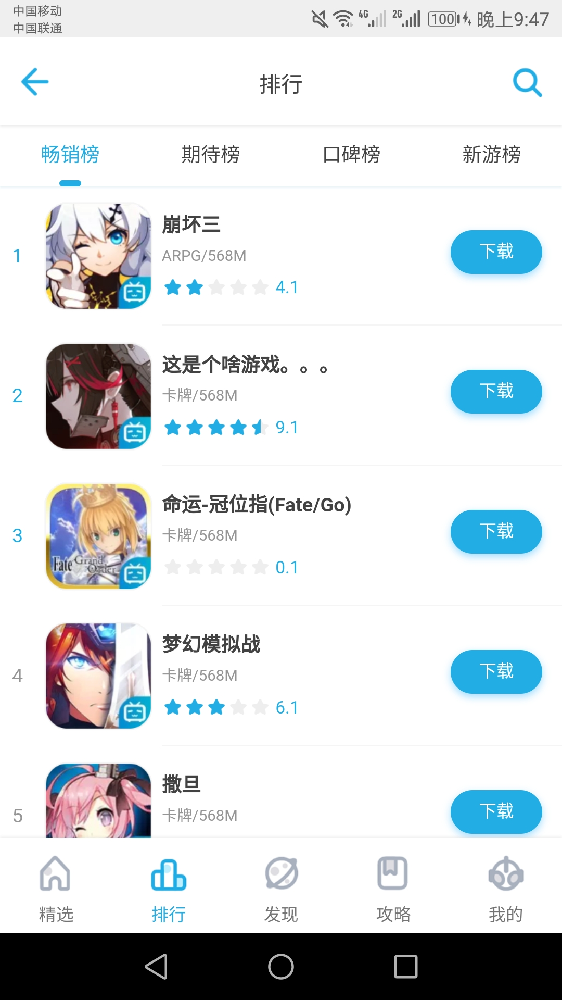
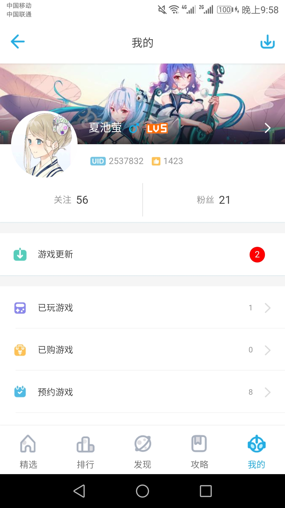
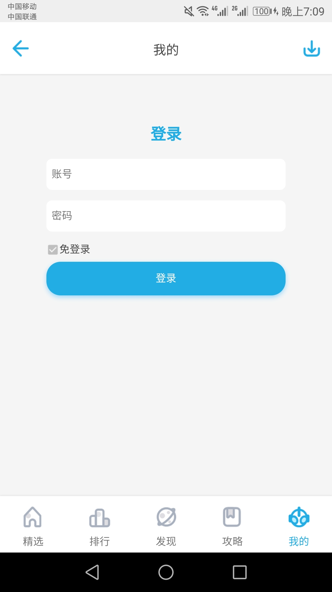
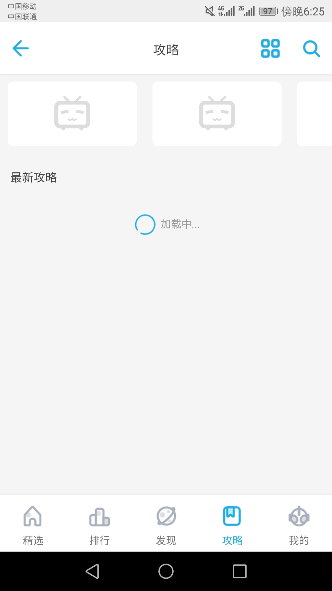
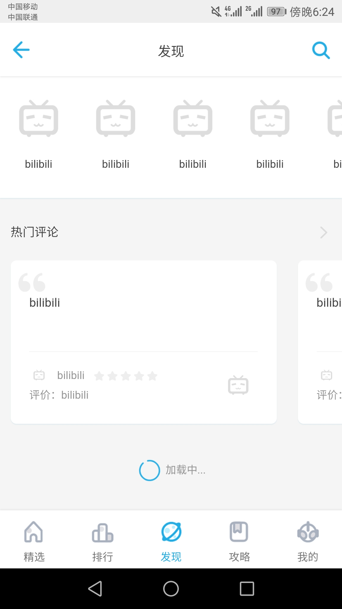

# 仿bilibili游戏中心

## 简介
（首先这个项目和官方没任何关系，只是前端页面像罢了。也没用官方的http接口，数据都是假数据，抠页面里要用的图片和图标累死了(╯°Д°)╯ ┻━┻）。）

使用react仿写的哔哩哔哩游戏中心（当我写完后发现官方更新了，和我这个版本不一样了）。本来是用es6写的项目，后来用typescript重写了前端项目，将后端的express换成了koa，并也用ts开发，完善了api功能，实现了登录功能。使用es写的旧版本在es分支。

[演示地址（请使用移动版Chrome或PC Chrome 的开发者工具查看）](http://blgc.suafe.cn)
### 备注
* 两个可用的登录用户

    |uid|pwd|
    |-|-|
    |10001|123|
    |10002|124|

## 部分截图展示
     

## 项目特色
* 前端
    
    * 精心仿写的ui，高还原哔哩哔哩游戏中。

    * 页面数据和状态记的录，切换页面不丢失数据，不必二次请求数据，原生般体验。
    
    * 组件化开发，可复用程度高。
    
    * 适配移动端touch的交互体验。
    
    * 使用网络上source图片loading渐变显示。
    
    * 页面滚动自动加载数据。
* 后端
    
    * 前后端分离。
    
    * 灵活的跨域api。
    
    * 跨域登录身份验证。
    
    * json数据存储。

## 前端技术栈

* typescript

* react

* react-redux

* react-router

* axios

## 后端技术栈

* typescript

* koa

后端没有使用数据库，用的json存储数据。写了一个json读取和行列筛选的功能。

## 目录说明
* client-ts
    ```shell
    client-ts
        ├─public      
        └─src 
            │  appConfig.ts         # client项目配置
            │  store.ts             # redux store
            ├─action                # redux action
            ├─api-request           # axios的http请求
            ├─components    
            │  ├─commonComponent    # 公共组件
            │  ├─commonFunc         # 公共函数
            │  ├─icons              # 图标库
            │  ├─nav                # 底部导航栏
            │  ├─pages              # 页面
            │  │  ├─find            # 第三个主要页面
            │  │  ├─home            # 第一个主要页面
            │  │  ├─gamePage
            │  │  ├─msg
            │  │  ├─my              # 第五个主要页面
            │  │  ├─my-download
            │  │  ├─notFound
            │  │  ├─rank            # 第二个主要页面
            │  │  ├─search
            │  │  ├─setting
            │  │  └─strategy        # 第四个主要页面
            │  └─titleBar           # 标题栏
            └─reducers              # redux reducer
    ```
* api-server-ts
    ```shell
    api-server-ts
        │  appConfig.json           # api server 配置
        ├─data                      # 放json数据的目录
        ├─dist                      # build 输出
        └─src           
            ├─db                    # 操作json的工具
            ├─middlewares           # 中间件
            ├─routes                # 路由
            ├─token                 # 用户登录token
            └─utilities             # 工具
    ```
* media-file

    这里是项目需要的图片文件，并没有和client放在一起，后面单独部署。

## 部署项目步骤
项目中一共有三个部分要部署
* 前端页面
* 后端api
* http媒体文件

|项目|url|
|:-|:-|
|前端页面|`blgc.example.com`|
|后端api|`api.example.com/blgc`|
|http媒体文件|`file.example.com/blgc`|

这样可以根据上表修改项目配置文件就不以出错。
* 部署媒体文件
    1. 用类似nginx这样的Web服务器，开起一个文件服务在`file.example.com`。
    
    2. 将`./media-file/`目录下所有的文件拷贝到`file.example.com/blgc/`。
    
    3. 浏览器打开`file.example.cn/blgc/gameicon/fgo.png`，确认是否部署成功。

* 部署前端项目
    1. 进入`./client-ts/src`，找到文件`appConfig.ts`
    
    2. 修改`appConfig.ts`里的配置如下

        ```js diff
        const appconfig = {
        -    apiRoot:"http://192.168.1.101:8000"
            +apiRoot:"http://api.example.com/blgc"
        }
        export {
            appconfig
        }
        ```

    3. 在`./client-ts`下执行命令`npm run build`
    
    4. 将`./client-ts/build`下所有内容拷贝到`blgc.example.com/`下
   
    5. 浏览器`blgc.example.com`，确认是否部署成功。
* 部署api服务
    1. 进入`./api-server-ts`，找到文件`appConfig.json`
    
    2. 修改`appConfig.json`配置

        ```json diff
        {
            -"AllowOrigin":"http://192.168.1.101:3000",
            +"AllowOrigin":"http://blgc.example.com",
            -"mediaFileRoot":"",
            +"mediaFileRoot":"http://file.example.com/blgc",
             "cookieMaxAge":16,
             "tokenMaxAge":15,
             "tokenSecretKey":"emm",
         }
        ```
    
    3. 在`./api-server-ts`下执行命令`npm run build`
    
    4. 在`./api-server-ts`下执行命令`npm start`启动项目，端口在8000。
    
    5. nginx反向代理
        * 要让nginx收到的`http://api.example.com/blgc/homebanner`指向`http://127.0.0.1:8000/homebanner`
        
        * nginx配置
            ```nginx
            server {
                listen 80;
                listen [::]:80;
                server_name api.example.com;
                location /blgc/ {
                    proxy_pass http://127.0.0.1:8000/;
                }
            }
            ```

        * 上面`location`必须是`/blgc/`，且`/blgc/`和`http://127.0.0.1:8000/`最后的斜杠都不能去掉。否则api server将会收到这样的请求`http://127.0.0.1:8000/blgc/homebanner`，将返回一个404
        
        * 这样的好处是部署api服务就不必浪费子域名了，每个api服务只是`api.example.com`，下的一个一级路由，比如添加一个在8001端口的api server就如下
            ```nginx
            location /projectname/ {
                proxy_pass http://127.0.0.1:8001/;
            }
            ```
        
        * 浏览器访问`http://api.example.com/blgc/homebanner`，确认部署是否成功

## 后端api
* 简单api

    |path|method|query|post data|response|说明|
    |:-|:-|:-|:-|:-|:-|
    |/homebanner|GET|-|-|{"homeBanner":[]}|首页轮播图|
    |/findbanner|GET|-|-|{"findBanner":[]}|发现页轮播图|
    |/rank/hot|GET|page=[number]&size=[number]|-|{"page":[]}|热门排行游戏列表|
    |/rank/good|GET|page=[number]&size=[number]|-|{"page":[]}|好评排行游戏列表|
    |/rank/new|GET|page=[number]&size=[number]|-|{"page":[]}|新游戏排行列表|
    |/rank/expect|GET|page=[number]&size=[number]|-|{"page":[]}|期待排行游戏列表|
    |/activity/newest|GET|-|-|{"item":{}}|最新游戏活动|
    |/activity/prev|GET|page=[number]&size=[number]|-|{"page":[]}|以前游戏活动|
    |/strategylist|GET|page=[number]&size=[number]|-|{"page":[]}|攻略列表|
    |/gameclassify|GET|page=[number]&size=[number]|-|{"page":[]}|游戏分类列表|
    |/hotgames|GET|type=[basic or all]&num=[number]|-|{"list":[]}|热门游戏列表|
    |/newgames|GET|type=[basic or all]&num=[number]|-|{"list":[]}|新游列表|
    |/ordergames|GET|type=[basic or banner]&num=[number]|-|{"list":[]}|可预约游戏列表|
    |/videostrategy|GET|&num=[number]|-|{"list":[]}|视频攻略|
    |/hotgames/banner|GET|-|-|{"list":[]}|热门游戏banner|
    |/biligames|GET|type=[basic or all]&num=[number]|-|{"list":[]}|bilibili游戏列表|
    |/paygames|GET|type=[basic or all]&num=[number]|-|{"list":[]}|付费游戏列表|
    |/hotcomments|GET|num=[number]|-|{"list":[]}|热门评论|
    |/hotsearch|GET|num=[number]|-|{"keys":[]}|热门搜索关键词|
    |/search|GET|key=[string]&actnum=[number]|-|{"data":{"games":[],"strategies":[]}}|游戏和攻略搜索|
    |/searchstrgy|GET|key=[string]&page=[string]&size=[number]|-|{"strategies":[]}|攻略搜索|

* 复杂api
    * 登录

        |path|method|query|post data|response|respons可能|
        |:-|:-|:-|:-|:-|:-|:-|
        |/login|POST|-|{uid: string,pwd: string, rememberme:boolean}|{"status": [number]}|status：1001登录成功，1002密码错误|
        登录成功后会在cookie设置好token

    * 自动登录验证

        |path|method|query|post data|response|respons可能|
        |:-|:-|:-|:-|:-|:-|:-|
        |/login|GET|-|-|{"status": [number]}|status:1011自动登录成功|
        当token过期或无token将会得到一个403的http状态。
        403时status1012: 无token（未登陆过)，1013: token过期（会删除token）
    * 获取已登录用户信息

        |path|method|query|post data|response|
        |:-|:-|:-|:-|:-|:-|
        |/user/info|GET|-|-|{"info":{}}|
        当token过期或无token将会得到一个403的http状态。
        403时status1012: 无token（未登陆过)，1013: token过期（会删除token）
    * 获取已登录用户菜单信息

        |path|method|query|post data|response|
        |:-|:-|:-|:-|:-|:-|
        |/user/menu|GET|-|-|{"menuInfo":{}}|
        当token过期或无token将会得到一个403的http状态。
        403时status1012: 无token（未登陆过)，1013: token过期（会删除token）

    

 
