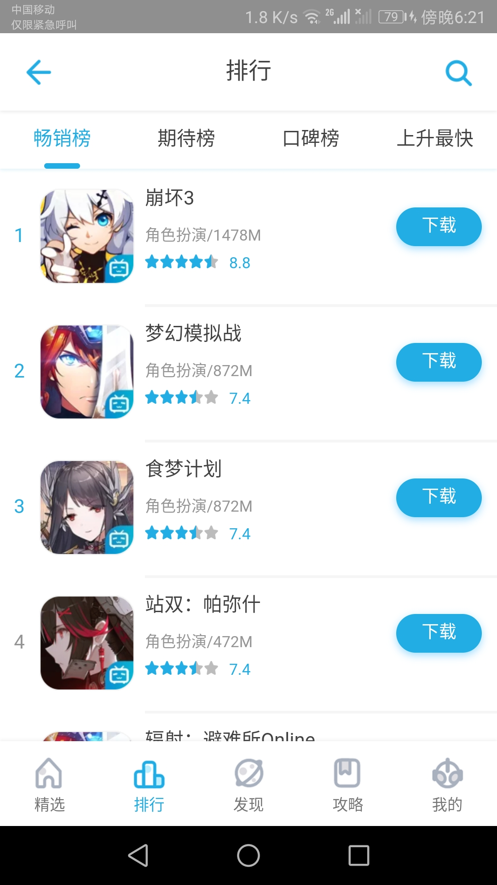
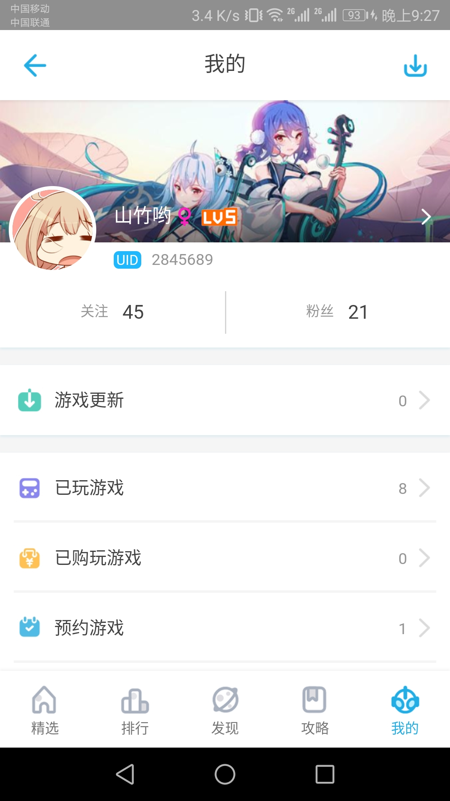

# bilibili game center

## 简介
使用react高仿的bilibili游戏中心（客户端5个页面，其他点击进入的页面未做）。

   <br/>
 

## 读前须知
* `./server`目录是一个使用express构建的简单的后台服务，用于测试前端请求，启动客户端前应先启动这个server
```
>cd server
 npm install
 npm start

>cd client
 npm insatll
 npm start
```
* 本app中的缓存并不是真正的缓存到本地，是为防止来回切换页面导致数据丢失和页面已经滚动的高度丢失而定义的全局变量（也通过这种手段防止了不必要的数据请求）。

## 目录结构

### client的src大概目录结构
```
 ├─src
    │  App.jsx
    │  App.less
    │  App.test.js
    │  index.css
    │  index.js
    │  normalize.css
    │  registerServiceWorker.js
    └─component
        ├─navBar                        #App下方导航条
        │  │  index.js                  
        │  └─view                       #导航条组件
        │      │  navBar.jsx
        │      │  style.less
        │      └─icons                  #导航条图标 
        ├─pages                         #App中间页面部分
        │  │  index.js
        │  └─view                       #App的5个分页
        │      ├─commonLess
        │      │      variable.less     #页面公共less变量(颜色、尺寸)
        |      |      animation.less    #动画
        |      ├─commonJsx              #页面公用组件库
        |      ├─commonFunction         #公用函数  
        │      ├─find                   #发现页
        │      ├─gameStrategy           #游戏攻略页
        │      ├─home                   #首页
        │      ├─my                     #用户
        │      └─rankingList            #游戏排行
        └─titleBar                      #标题栏
            │  index.js
            └─view                      #标题组件
                    style.less
                    titleBar.jsx
```
### 构建
* ` ./client ` 目录 ` npm run build `
* 拷贝 ` ./client/build/ ` 下的所有内容到 ` ./server/public `
* ` ./server ` 目录下 ` npm start `
