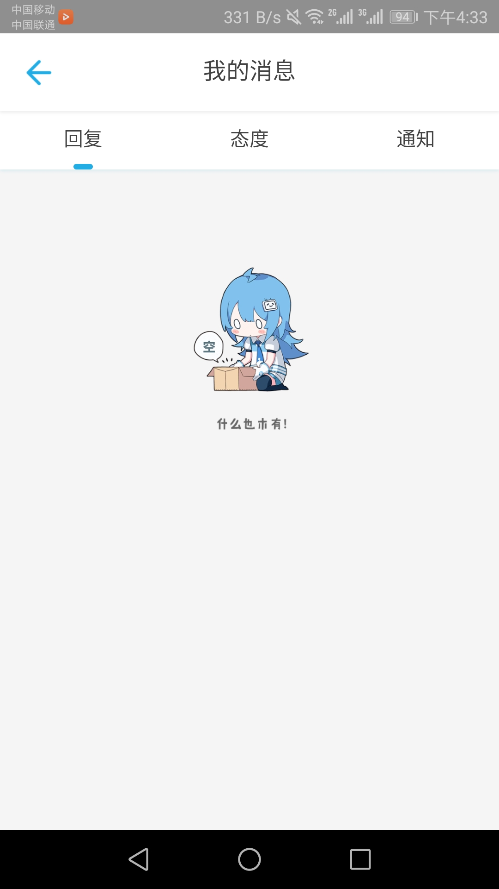

# bilibili game center

## 简介
使用react高仿的bilibili游戏中心。

   <br/>
  <br/>

## 读前须知
* `./server`目录是一个使用express构建的简单的后台服务，用于测试前端请求，启动客户端前应先启动这个server
```
>cd server
 npm install
 npm start

>cd client
 npm insatll
 npm start
```
* 本app中的缓存并不是真正的缓存到本地，是为防止来回切换页面导致数据丢失和页面已经滚动的高度丢失而定义的全局变量（也通过这种手段防止了不必要的数据请求）。

## 目录结构

### client的src目录
```
src
└─component
    ├─navBar                #标题栏条
    ├─pages
    │  ├─commonFunction     #公用函数
    │  ├─commonJsx          #公共组件
    │  ├─commonLess         #less变量
    │  ├─icons              #图标和固定图片
    │  ├─link-pages         #次要页面
    │  │  ├─download        #下载管理
    │  │  ├─msg             #消息页面
    │  │  └─search          #搜索页面
    │  └─main-pages         #5个主要页面
    │      ├─find           #发现页
    │      ├─gameStrategy   #攻略页
    │      ├─home           #首页
    │      ├─my             #用户页
    │      └─rankingList    #排行榜
    │                  
    └─titleBar              #下方导航条
```

                    

### 构建
* ` ./client ` 目录 ` npm run build `
* 拷贝 ` ./client/build/ ` 下的所有内容到 ` ./server/public `
* ` ./server ` 目录下 ` npm start `
